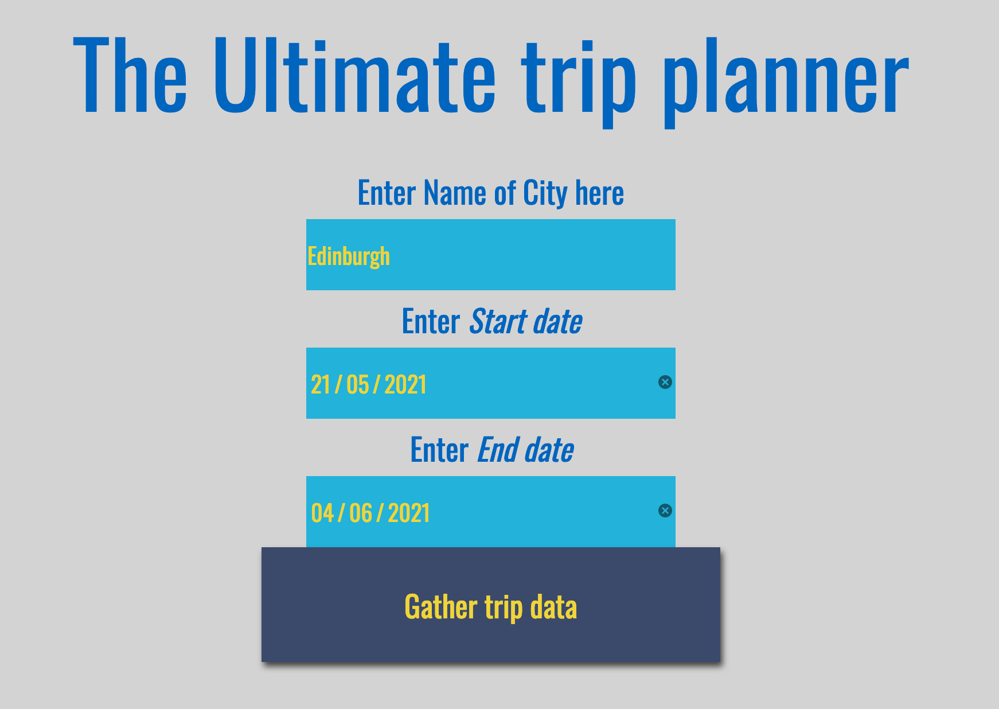
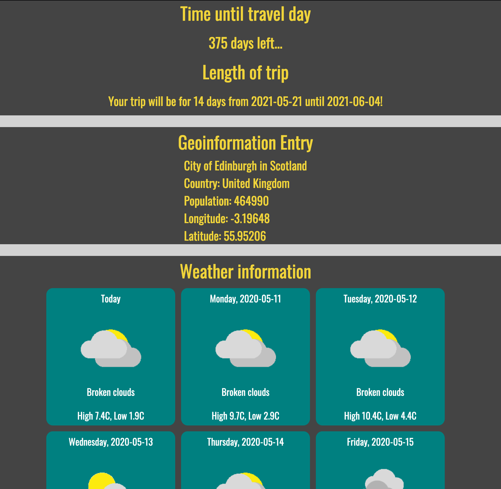

# Capstone Project Travel App for Udacity Nanodegree

## Overview
In this project I created an asynchronous web app that uses serveral web APIs to fetch data that ensembles a possible trip for a user. 

The following APIs are used:
1. Pixabay
2. Weatherbit
3. Geoname

##  Extend the project content

The project content is extended in order to foster a deeper understanding of the web technologies used here.

* End date added and a countdown calculated & displayed
* Images for the country are added
* forecast for several days is added and icons are included

## Previews

__This is how the form looks__

__This is how the result can look__

